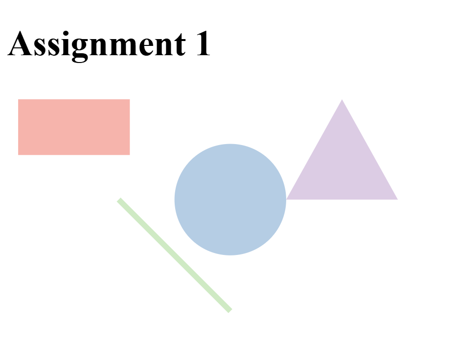

Assignment 1 - Hello World: GitHub and d3  
Asha Buchanan

Link: https://ajb-18.github.io/a1-ghd3/

Screenshots: 

Notes: Implemented 4 different shapes utilizing d3! All guidance was through the official d3 website and documentation and I played around with different sizes of the shapes. I found the d3 colour pallete and I decided to try and implement that to the shapes just for some extra creativity. Another feature I implemented was an interactive hover feature where when you hover over a shape it turns a bit opaque, I found that feature on the d3 website as well! 

